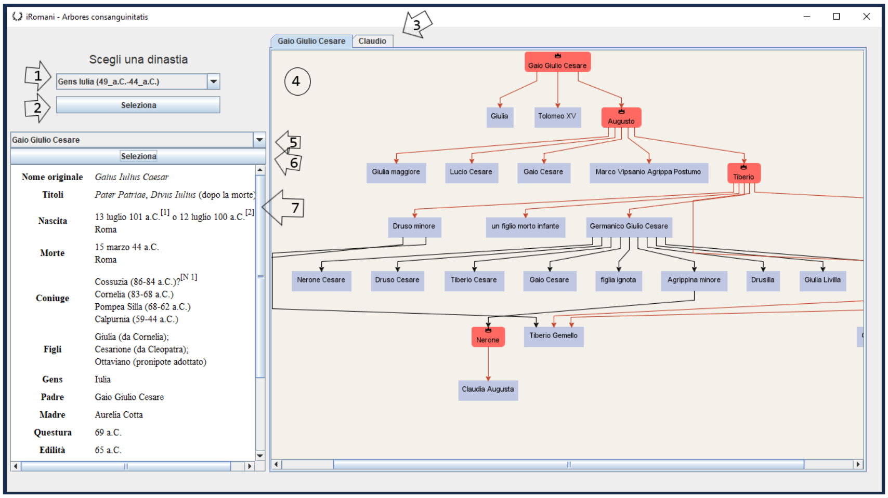

# Wikipedia Web Scraper

This Java project was created for the exam of "programming methodologies", a course in the first year of computer science at La Sapienza University in Rome. The course covered object-oriented programming through the teaching of Java.  
The code is in Italian because the language of the exam was Italian.  
When I built the project, I had no knowledge of HTML, CSS, DOM and parsing as I was at the beginning of my academic career. Therefore, I worked independently to first understand what needed to be done and then figure out how to do it.

## Interface

1. Menu where you can choose the dynasty whose genealogical trees you want to view. It contains the list of all emperor dynasties. Each table present in the wiki is considered as a dynasty.

2. Button to initialize scraping for the selected dynasty with selenium and Chrome.

3. If there are multiple genealogical trees for the emperors of the selected dynasty because the two emperors do not belong to the same bloodline, a tab will be present above the central window for each.

4. In this window, genealogical trees are displayed. Emperors are highlighted with a red label and a crown above their name.

5. For every historical figure present in the trees whose Wikipedia page contains the summary table called a synoptic, you can view the contained information.

6. Press the select button to display summary information about the chosen historical figure in the dropdown menu.

7. The window where summary information about the chosen historical figure is displayed. Repeat steps 5 and 6 to change the person.

## Request for the exam and scope of the code

The practical exam consists of writing a web scraper for Wikipedia to build the genealogical tree for each dynasty of Roman emperors listed on this [page](https://en.wikipedia.org/wiki/List_of_Roman_emperors). Most of the processes need to be automatic.

## Project Web Scraper
The repository contains the code written for the programming methodologies exam of the computer science course at La Sapienza in Rome.

The exam requirement is to create a web scraper to reconstruct the genealogical trees of Roman emperors listed on this [page](https://it.wikipedia.org/wiki/Imperatori_romani). The process should be as automatic as possible.

All the code was written by me, independently. The conception and creation were the result of study, reflection, and in-depth exploration of the topics proposed during the course; no code from external sources was used in any part.

### Structure /src

In the first phase, I wrote two libraries: one that allows scraping a large part of the information in the sidebar of any Wikipedia page (called a synoptic), the second that allows creating a genealogical tree of any class that implements an interface.

In the second phase, I created "iRomani," which is the program that scrapes from Wikipedia and displays the genealogical trees of the dynasties/historical periods of the emperors.

### 1) Sources:
All project sources are inside the folder `WikipediaWebScraper`.

### 2) Necessary Tools:
All the libraries and tools necessary for the correct execution of the program are inside the folder. The libraries are inside the folder `WikipediaWebScraper/lib`.

For the correct operation of Selenium, Chrome Version 93.0.4577.82 is required. All tests were performed on version 93.0.4577.82 (Official Build) (64-bit).

To use an earlier version of Chrome, it is necessary to replace the ChromeDriver inside the /res folder by downloading the one for your version from the site https://chromedriver.chromium.org/downloads, but correct functioning is not guaranteed.

The code was written with Java 15.

### 3) Running the Code:
The main of the program is located inside the folder `src/iRomaniController/iRomani/iRomaniMain.java`.

### 4) Sources:
All project sources are inside the folder WikipediaWebScraper.

### 5) Documentation:
The report, class UML, and the GUI manual are inside the `Documentazione` folder.

